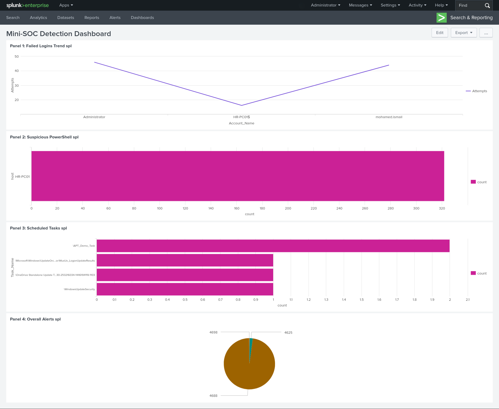
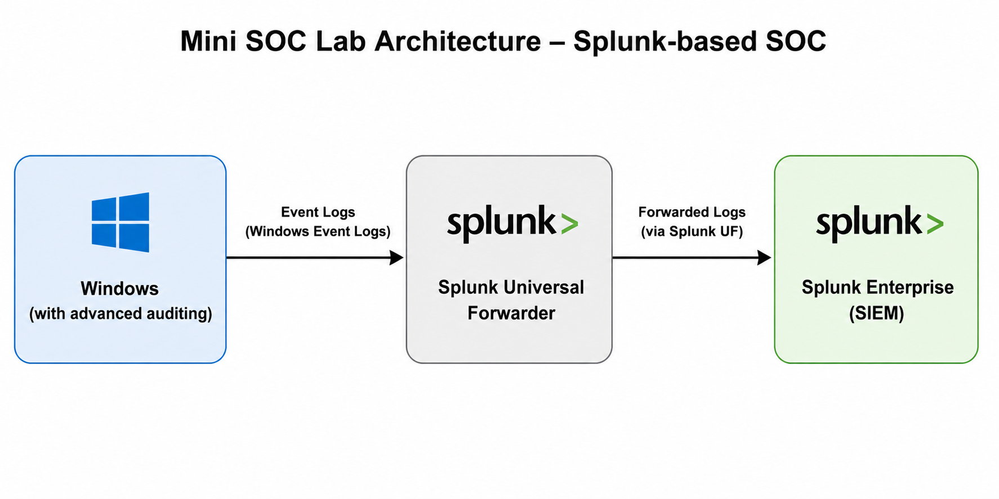
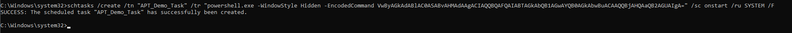
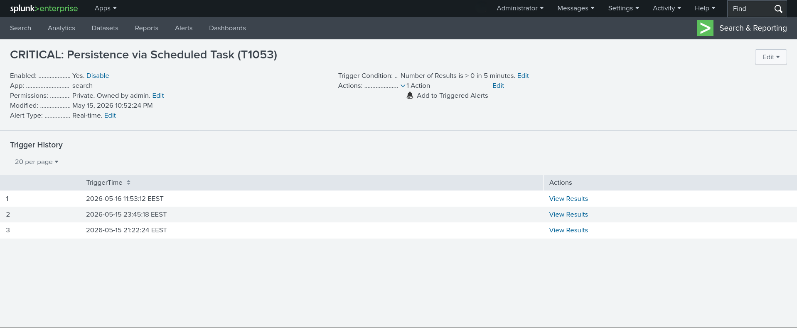
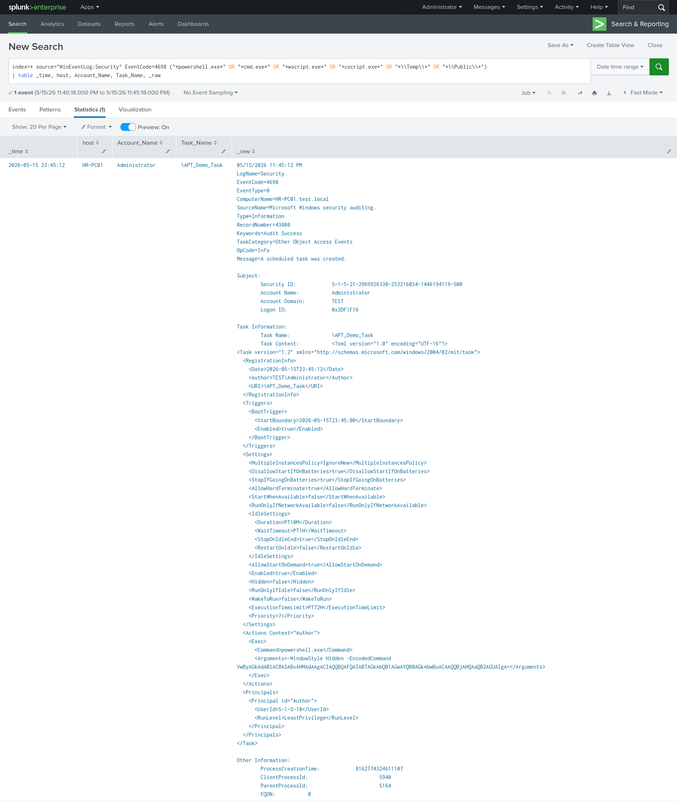
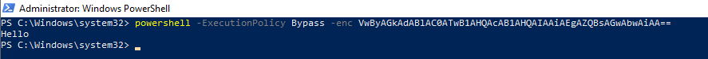
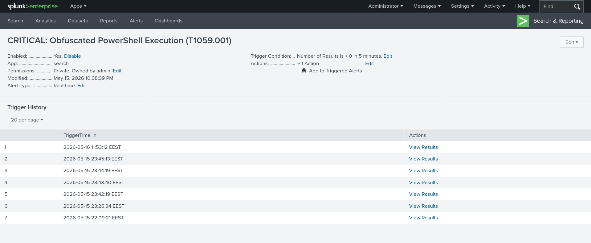
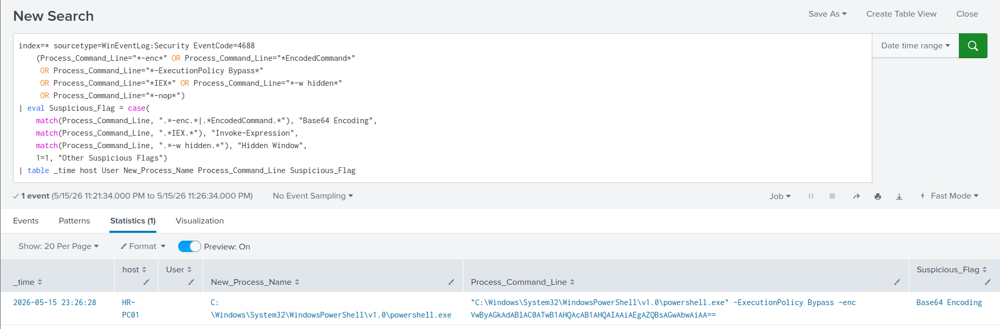
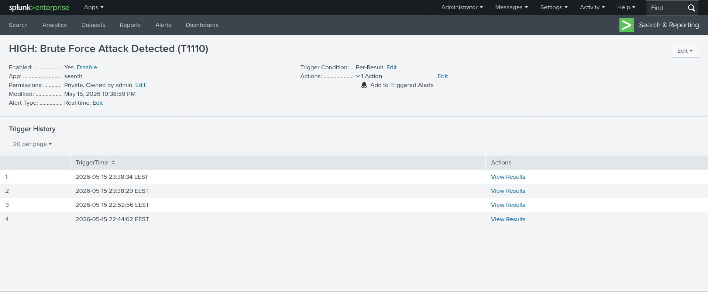

# Mini SOC – Splunk Enterprise Detection Lab

Hands-on blue team project demonstrating a **Mini Security Operations Center (SOC)** using **Splunk Enterprise** as a SIEM solution.

The project focuses on practical SOC workflows including:

* Log collection
* Windows event monitoring
* Detection engineering using SPL
* Alert creation
* Threat investigation
* Dashboard visualization

---

## Dashboard Preview

```md

```

---

## Project Overview

This project was created to simulate how a SOC analyst detects suspicious activity inside a Windows environment using Splunk.

Instead of simply forwarding logs, the goal was to:

* Configure Windows auditing for better visibility
* Create custom detections using SPL
* Generate alerts for suspicious activity
* Investigate attacker behavior
* Present findings in a SOC-style dashboard

The lab simulates realistic attacker techniques and demonstrates how they can be identified through Windows telemetry and Splunk detections.

---

## Lab Architecture

The environment consists of:

* **Windows Endpoint**
* **Splunk Universal Forwarder**
* **Splunk Enterprise (SIEM)**

### Architecture Diagram

```md

```

### Data Flow

```
Windows Endpoint
        ↓
Splunk Universal Forwarder
        ↓
Splunk Enterprise
```

---

## Detection Use Cases

| Use Case                   | MITRE ATT&CK | Event IDs  |
| -------------------------- | ------------ | ---------- |
| Scheduled Task Persistence | T1053.005    | 4688, 4698 |
| Suspicious PowerShell      | T1059.001    | 4688       |
| Brute Force Detection      | T1110        | 4625       |

---

# 1. Scheduled Task Persistence Detection

## Objective

Detect persistence attempts through malicious scheduled task creation.

Attackers commonly use scheduled tasks to maintain persistence after reboot or user logon.

**MITRE Technique:** `T1053.005 – Scheduled Task`

---

## Attack Simulation

A scheduled task was created to simulate persistence behavior.

**Command executed:**

```
schtasks /create /tn "WindowsUpdateSecurity" /tr "notepad.exe" /sc onlogon /ru SYSTEM
```

### Attack Execution

```md

```

---

## Detection Logic

The detection monitors:

* **Event ID 4688** for `schtasks.exe` execution
* **Event ID 4698** for new scheduled task creation

**Example SPL:**

```
index=* (EventCode=4688 OR EventCode=4698)
| search CommandLine="*schtasks*" OR TaskName="*"
```

### Detection Result

```md

```

---

## Investigation

Correlated process creation with task creation activity to identify persistence behavior.

### Investigation View

```md

```

---

# 2. Suspicious PowerShell Detection

## Objective

Detect suspicious PowerShell execution patterns commonly associated with attacker activity.

**MITRE Technique:** `T1059.001 – PowerShell`

---

## Attack Simulation

A PowerShell command using encoded execution was executed.

```
powershell -ExecutionPolicy Bypass -enc VwByAGkAdABlAC0ATwB1AHQAcAB1AHQAIAAiAEgAZQBsAGwAbwAiAA==
```

### Attack Execution

```md

```

---

## Detection Logic

Detection focuses on suspicious PowerShell indicators such as:

* `-enc`
* `-EncodedCommand`
* `IEX`
* Hidden execution patterns

### Detection Result

```md

```

---

## Investigation

Investigated process execution details including command-line arguments and parent process relationships.

### Investigation View

```md

```

---

# 3. Brute Force Detection

## Objective

Detect repeated failed authentication attempts.

**MITRE Technique:** `T1110 – Brute Force`

---

## Attack Simulation

Multiple failed login attempts were generated manually to simulate brute-force behavior.

### Detection Result

```md

```

---

## Alert Triggered

```md

```

---

## Analysis View

Repeated failures were visualized over time to identify abnormal authentication behavior.

```md

```

---

# Dashboard

A custom Splunk dashboard was created to centralize detections and improve visibility.

Dashboard includes:

* Failed logon activity
* Scheduled task detections
* Suspicious PowerShell activity
* Security event overview

```md

```

---

## Skills Demonstrated

* Splunk Enterprise
* SPL (Search Processing Language)
* Windows Event Logging
* Detection Engineering
* Alert Development
* Log Investigation
* Windows Security Monitoring
* MITRE ATT&CK Mapping
* Dashboard Creation

---

## Lessons Learned

This project improved hands-on understanding of:

* Windows telemetry
* Event correlation
* Detection tuning
* Alerting workflows
* SOC investigation methodology

---

## Author

**Mohamed Ismail**
SOC / Security Operations Enthusiast
